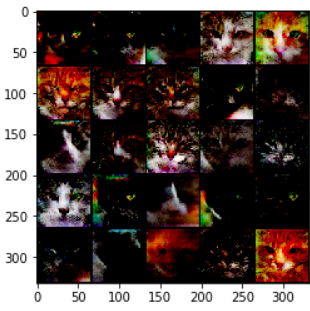

# Implemetation of DCGAN 
Paper - [DCGAN](https://arxiv.org/pdf/1511.06434.pdf) 
Framework used - [PyTorch](https://pytorch.org/) 
Dataset used - [Kaggle dataset](https://www.kaggle.com/spandan2/cats-faces-64x64-for-generative-models) 
> ` Results of Cat image generation using DCGAN `
  
> 
